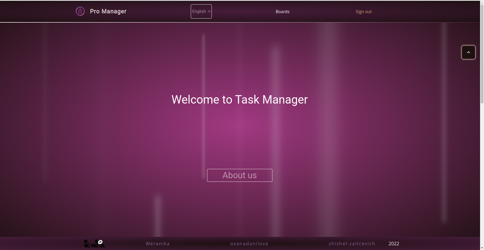
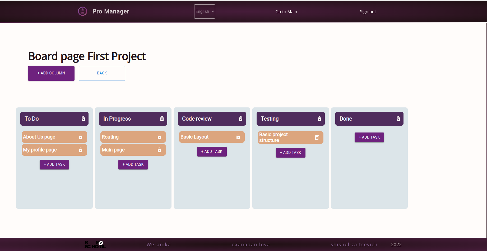

# Project name: Project manager

_**Project manager** is an application that helps a team or group of developers to achieve their goals. It is possible to create new boards, columns or tasks and also update or delete them._

[Demo](https://oxanadanilova.github.io/projectmanager/)

[Backend](https://rss-app-project-manager.onrender.com/api-docs/#/)

---

 

---

## Description

This is the team project of the _React 2022 Q3_ course of the [Rolling Scopes School](https://rs.school/index.html).
It was designed according to the [task](https://github.com/rolling-scopes-school/tasks/blob/master/tasks/react/project-management-system-EN.md). The backend part was developed by another development team.

---

## Technologies

HTML5, SCSS, JavaScript, React, NPM, TypeScript, Material UI, Redux, React hook form

---

## Contact

[Oxana Danilova](https://www.linkedin.com/in/oxana-danilova-b082a0156/)

[Weranika](https://github.com/Weranika)

[Katerina](https://github.com/shishel-zaitcevich)

---

Made with ❤️
